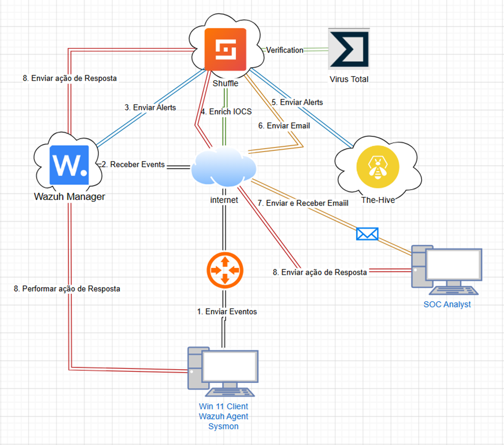
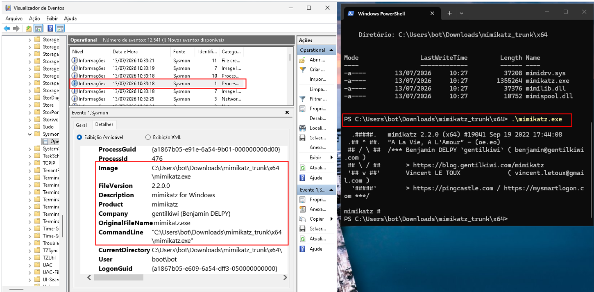
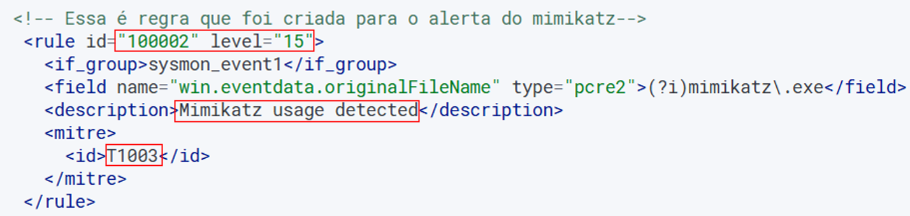
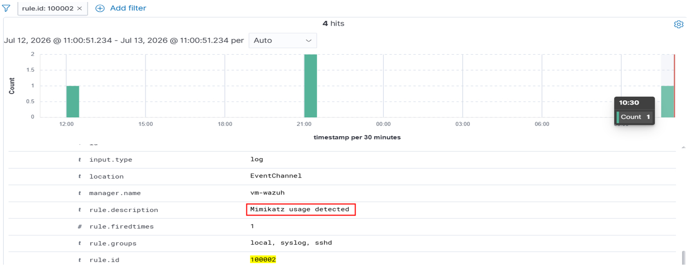
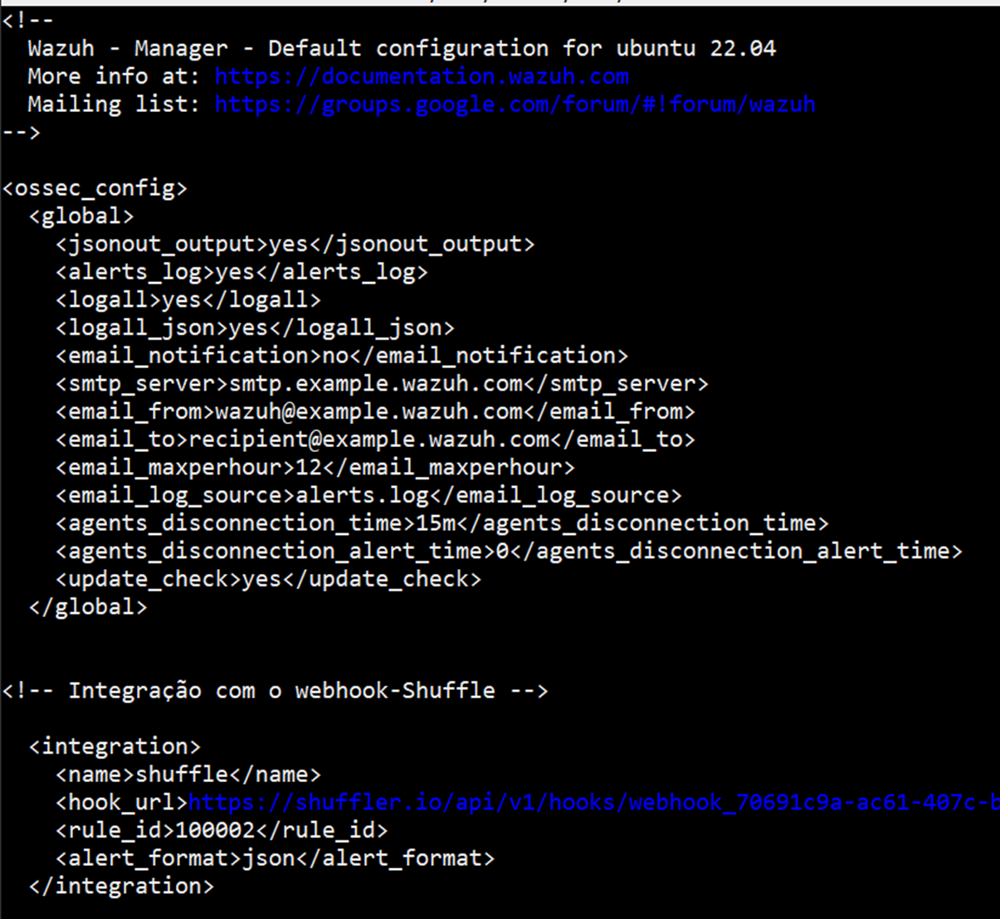
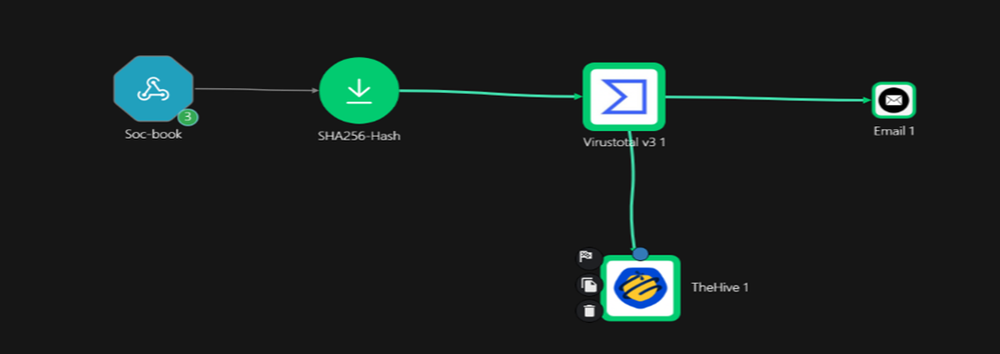
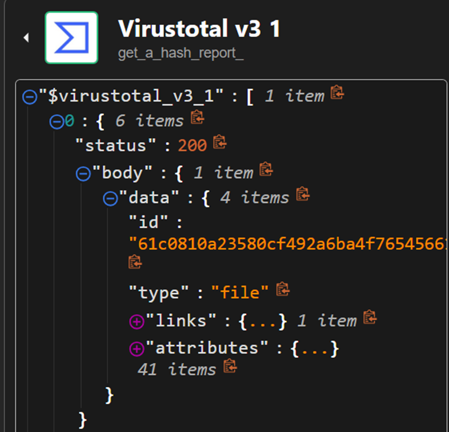
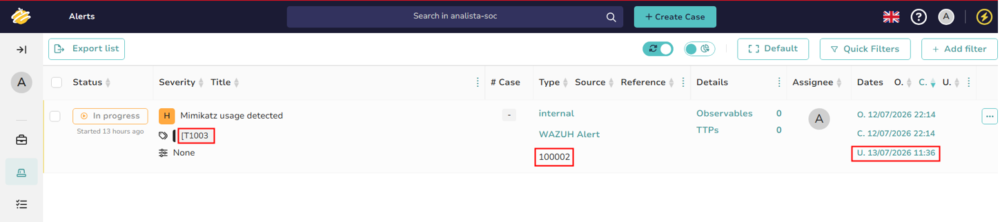
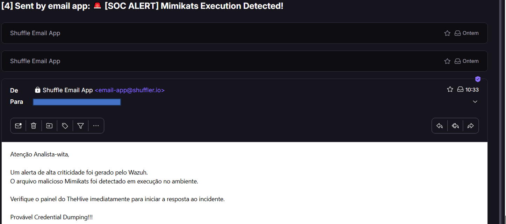

# SOC Automation Lab: Detecção e Resposta Automatizada a Ameaças
### Arquitetura Integrada: Sysmon ➔ Wazuh (SIEM) ➔ Shuffle (SOAR) ➔ VirusTotal API ➔ TheHive (IR) & ProtonMail

 

---

## 📌 Visão Geral do Projeto
Este projeto documenta a implementação de um laboratório de **Automação de SOC (Security Operations Center)** focado na detecção e mitigação de ataques de **Credential Dumping** em tempo real. O principal objetivo foi criar um ecossistema integrado que automatiza o ciclo de vida completo de um incidente (coleta de telemetria, correlação de eventos, enriquecimento de indicadores, abertura de casos e notificação crítica), reduzindo drasticamente o tempo de resposta (MTTR) e mitigando a fadiga de alertas (*Alert Fatigue*) dos analistas de segurança.

O cenário simula a execução do utilitário malicioso **Mimikatz.exe** em um host corporativo Windows 11, desencadeando um fluxo automatizado de resposta orquestrada.

---

## 🏗️ 1. Arquitetura do Laboratório e Fluxo de Dados
O ecossistema foi projetado para garantir que os dados de eventos fluam de forma contínua e assíncrona entre as camadas de Endpoint, SIEM, SOAR e plataformas de gerenciamento.

*Diagrama de arquitetura de rede e fluxo de dados do ecossistema de SOC, ilustrando a jornada da telemetria desde o endpoint até as camadas de detecção (SIEM), automação (SOAR), inteligência de ameaças e gerenciamento de incidentes.*

---

## 🛠️ Tecnologias Utilizadas e seus roles

| Camada | Ferramenta | Função |
|---|---|---|
| Endpoint | Windows 11 + Sysmon | Telemetria de processos em tempo real no endpoint |
| SIEM | Wazuh | Correlação de eventos e engenharia de detecção |
| SOAR | Shuffle | Orquestração do workflow de resposta |
| Threat Intel | VirusTotal API v3 | Enriquecimento de IOC (hash SHA-256) |
| IR | TheHive | Plataforma para IR (Resposta a Incidentes) estruturada para triagem e auditoria. |
| Notificação | ProtonMail | Alerta em tempo real ao analista |
---

## 🔬 2. Execução do Ataque e Telemetria do Endpoint
O gatilho do incidente inicia-se com a simulação do adversário executando ações táticas de extração de credenciais no host Windows 11.

*Execução controlada do utilitário malicioso `mimikatz.exe` (Credential Dumping) no host Windows 11, capturada instantaneamente pelo Sysmon através do evento de criação de processo em tempo real (Event ID 1).*

---

## 🎯 3. Engenharia de Detecção e Centralização (SIEM)
A transformação do log bruto do Sysmon em um alerta de segurança acionável foi realizada por meio do desenvolvimento de lógicas customizadas baseadas em assinaturas do binário e mapeadas para frameworks globais.

### Regra Customizada (`local_rules.xml`)

*Regra customizada de Engenharia de Detecção estruturada em XML (ID `100002`, Nível 15) dentro do Wazuh Manager, projetada para validar assinaturas de processo baseadas no campo `originalFileName` do binário malicioso e mapeada ao framework MITRE ATT&CK.*

### Consolidação dos Alertas no Dashboard

*Visão analítica do painel do Wazuh exibindo a volumetria e a consolidação dos alertas críticos gerados em tempo real após o gatilho da atividade adversária no endpoint.*

### Integração Nativa via Webhook (`ossec.conf`)

*Arquivo de configuração global do Wazuh (`ossec.conf`) demonstrando o bloco de integração nativa configurado para encaminhar os dados JSON dos alertas específicos via webhook para a plataforma de orquestração.*

---

## ⚡ 4. Orquestração e Enriquecimento Automático (SOAR)
O coração da automação reside no **Shuffle SOAR**, que recebe o payload do Wazuh, isola o hash criptográfico (SHA-256) do processo suspeito e realiza o enriquecimento do Indicador de Comprometimento (IOC).

*Workflow de automação e resposta a incidentes estruturado no Shuffle (SOAR), exibindo a execução bem-sucedida em cascata de todas as etapas (ingestão do log, extração de metadados, consultas externas e notificações).*

### Consulta de Cyber Threat Intelligence (VirusTotal v3)

*Retorno estruturado (Payload JSON) com Status `200 Ok` gerado pela API do VirusTotal v3 integrada ao Shuffle, confirmando a identificação e reputação maliciosa do hash SHA-256 extraído do incidente.*

---

## 🚨 5. Triagem de Incidentes e Notificação Crítica
Uma vez verificado o veredito malicioso do IOC, o SOAR popula o sistema de resposta a incidentes de forma estruturada e paralelamente notifica o analista de plantão por canais externos.

### Console de Incident Response (TheHive)

*Console de gerenciamento de incidentes do TheHive consolidando o alerta, contendo metadados enriquecidos como a severidade do evento, referências cruzadas de ID, status inicial de triagem e a respectiva tag do MITRE ATT&CK.*

### Notificação Direta ao Analista (E-mail App)

*Notificação crítica e instantânea enviada de forma automatizada pelo SOAR à caixa de entrada do analista de SOC (ProtonMail), contendo os detalhes contextuais da ameaça para tomada de decisão ágil e resposta ao incidente.*

---

## 📈 Resultados e Aprendizados Técnicos
* **Mitigação de Alert Fatigue:** A automação filtrou, extraiu e consultou o hash de forma autônoma. O analista recebe apenas o caso pronto e enriquecido, reduzindo o tempo gasto em tarefas repetitivas.
* **Mapeamento MITRE ATT&CK:** Alinhamento técnico do monitoramento com as táticas globais de adversários, garantindo que o alerta chegue indexado sob a técnica **T1003 (Credential Dumping)**.
* **Arquitetura Orientada a APIs:** Forte aprendizado prático na modelagem e manipulação de payloads JSON, uso de Webhooks e consumo de APIs RESTful estruturadas em ambientes de segurança de alta performance.

---
 
## 🛠️ Stack
 
`Windows 11` `Sysmon` `Azure[vm/vnet]` `Wazuh` `Shuffle` `VirusTotal API v3` `TheHive` `ProtonMail`
 
---
 
## 📚 Referências
 
Projeto inspirado no [SOC Automation Lab do MyDFIR](https://youtu.be/f18isDfMIlY?si=_KLKDAnL8W236QNe), adaptado e documentado com arquitetura, regras e workflow próprios.
 